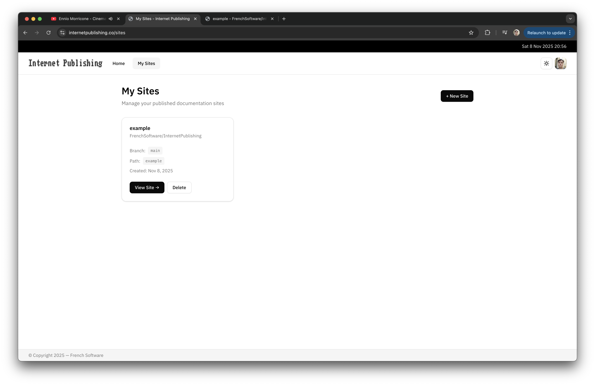
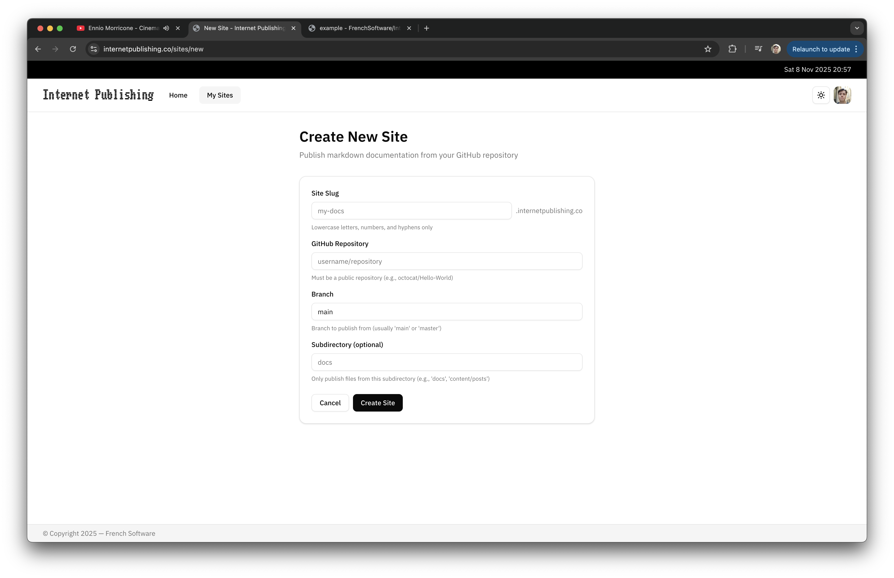
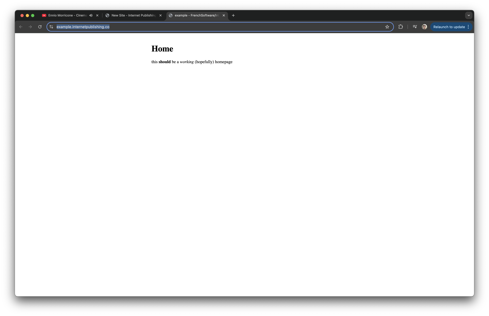

[](https://discord.gg/MaqTgPF3Ch)

# Internet Publishing

> Publish Markdown documents from your Github repositories

## Development

**Requirements:** Go 1.25.0+

1. Clone and install dependencies:
```bash
git clone https://github.com/frenchsoftware/InternetPublishing.git
cd InternetPublishing
go mod download
```

2. Create `.env` file:
```env
HTTP_ADDR=:8080
DATABASE_URL=file:app.db
BASE_URL=http://localhost:8080
GOOGLE_CLIENT_ID=your_client_id
GOOGLE_CLIENT_SECRET=your_client_secret
```

3. Set up Google OAuth at [console.cloud.google.com](https://console.cloud.google.com/) and add `http://localhost:8080/auth/google/callback` to redirect URIs

4. Run:
```bash
make dev
```

Open `http://localhost:8080`

## Demo







## License

[AGPL-3.0](./LICENSE)
